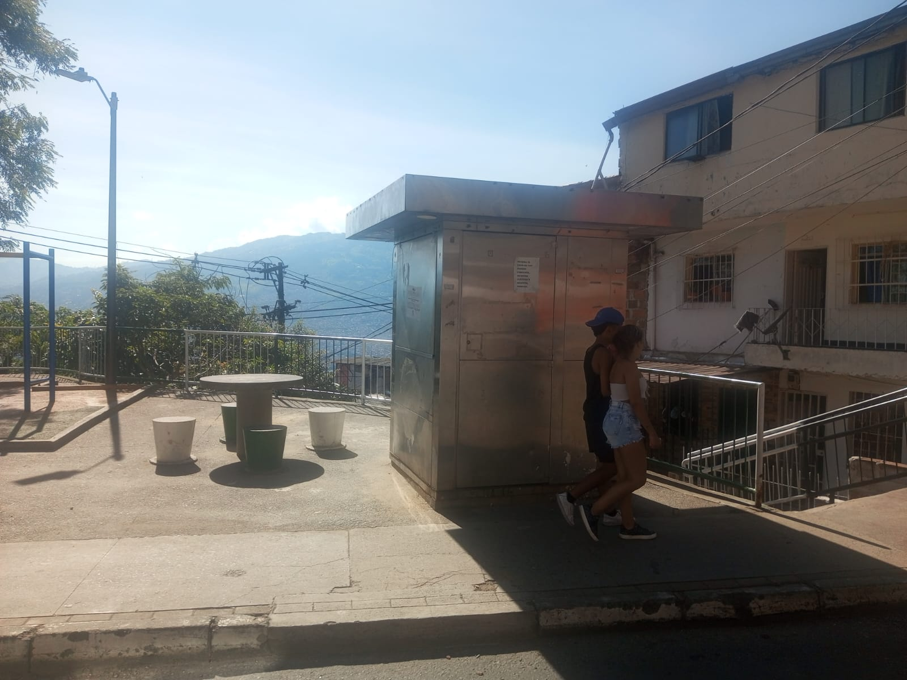

# MULTIPLICA - Laboratorio de Innovación Social (Manrique, Medellín)

## 🚀 Misión
MULTIPLICA es una red de aprendizaje comunitario en la Comuna 3 (Manrique, Medellín) que utiliza la tecnología y el aprendizaje entre pares como motores para multiplicar talentos.

## ✨ Características Principales
- **Metodología de Pares**: Jóvenes con conocimientos avanzados enseñan y guían a otros en sus retos escolares y proyectos creativos.
- **Laboratorio IA**: Un mentor virtual prototipado para guiar rutas de aprendizaje personalizadas.
- **Pizarra Colaborativa**: Espacio interactivo para resolver retos matemáticos y de diseño en tiempo real.
- **Archivo Vivo**: Línea del tiempo interactiva que documenta la memoria y evolución del proyecto.
- **Mapa de Quioscos**: Red visual de los nodos físicos del proyecto en el barrio.

## 🎨 Estética Cyberpunk-Manrique
El proyecto cuenta con una interfaz moderna basada en **Glassmorphism** y una paleta de colores neón (Magenta & Cian), reflejando la identidad de una "ladera inteligente".

## 🛠️ Tecnologías
- HTML5 / CSS3 (Vanilla CSS con Grid y Flexbox)
- JavaScript (Vanilla JS ES6+)
- Animaciones dinámicas (Lluvia de Matrix, Blobs neón)

## 👨‍💻 Desarrollo
Desarrollado con el apoyo de **Impact Maker** y la comunidad de Manrique.

---
© 2026 Comunidad MULTIPLICA. Todos los derechos reservados.
